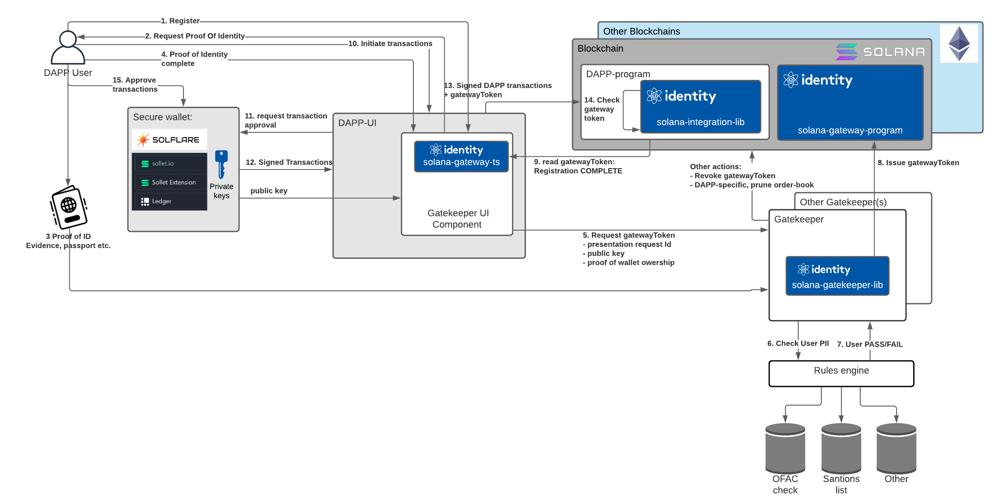

# On-chain Identity Gateway

Welcome to the Identity.com On-chain Identity Gateway monorepo.

This repository contains libraries that help a
smart contract or program on the Blockchain with regulations
and guidances from 
[FATF](https://www.fatf-gafi.org/media/fatf/documents/recommendations/March%202021%20-%20VA%20Guidance%20update%20-%20Sixth%20draft%20-%20Public%20consultation.pdf),
[US OFAC](https://home.treasury.gov/policy-issues/office-of-foreign-assets-control-sanctions-programs-and-information),
[US OCC BSA](https://www.occ.treas.gov/topics/supervision-and-examination/bsa/index-bsa.html) and others.

## Cross-chain

This repository focuses on the Solana blockchain, but other implementations,
as well as cross-chain features, are coming soon.

## The Model

On-chain applications require users to present a Gateway Token, which proves that they have
been verified by a Gateway Provider to use the dApp. This token is tied to their wallet
and is non-transferable.

[Source](https://lucid.app/lucidchart/4f890182-deae-46a0-bd2d-9abd3da803d3/view)

## API Documentation

### Solana
- [Gatekeeper Lib API](solana/gatekeeper-lib/docs)
- [Gateway-TS API](solana/gateway-ts/docs)

## Repo structure

This repository contains a number of libraries,
which combine to define the on-chain gateway protocol.

Inside each chain's directory (e.g. solana/) are the following libraries:

| Directory      	| Description                                                                                               | Published at                                                                      |
|------------------	|---------------------------------------------------------------------------------------------------------	|-----------------------------------------------------------------------------------|
| http-client       | Used by dApp developers to discover and use gateway tokens and to interact with gatekeepers               | [npm](https://www.npmjs.com/package/@identity.com/solana-gateway-http-client) 	|
| gateway-ts        | Wrapper library for the blockchain smart-contract or program                                              | [npm](https://www.npmjs.com/package/@identity.com/solana-gateway-ts)              |
| integration-lib	| Used by on-chain program or smart-contract developers to restrict the contract to authorised users only 	|                                                                                   |
| program           | The source-code for the gateway program or smart-contract                                               	|                                                                                   |
| gatekeeper-lib    | Used by gatekeepers to allow them to issue gateway tokens on the chain.                                 	| [npm](https://www.npmjs.com/package/@identity.com/solana-gatekeeper-lib) 	        |

## Integration

### For DeFi developers (Solana)

#### On-chain: 
Follow the steps in solana/integration-lib to add gateway functionality to your dApp

#### Client/UI:
Follow the steps in solana/client to integrate the client library into to your dApp's
client library and/or UI.

### For Gateway providers
If you are interested in becoming a gateway provider, and issuing gateway tokens,
please contact us at contact@identity.org

## Contributing

Before contributing, please read the [contributing guidelines](CONTRIBUTING.md)
and [code of conduct](CODE_OF_CONDUCT.md).